# Citari

Multi-tenant booking platform for service businesses. This repository holds
the database, the API, the frontend, and Citari's documentation.

Summary

Citari is a multi-tenant booking platform for service businesses. The
database is the core, and the project includes the API, frontend, and Docker
setup for the full booking, administration, and tracking flow.

## Index

- [Documentation](#documentation)
- [Quick structure](#quick-structure)

## Documentation

- [docs/api-handover.md](docs/api-handover.md) API handover: conventions, full endpoint table, curl examples, statuses
- [docs/sql-signatures.md](docs/sql-signatures.md) reference for stored procedures, views, functions, triggers, and THROW codes
- [docs/deployment.md](docs/deployment.md) production deployment: Docker images, GHCR publishing, and required configuration

**Other:**

- [database/docs/PASSWORDS.md](database/docs/PASSWORDS.md) development credentials (seed data)

## Quick structure

- [apps/frontend](apps/frontend) Next.js app
- [apps/api](apps/api) FastAPI backend
- [database](database) database scripts and resources
- [docs](docs) full documentation

## Getting started

### Requirements

- Docker Desktop (or Docker Engine + Docker Compose v2).

### One command

```bash
docker compose up --build
```

Compose ships with development defaults, so no prior configuration is
needed. The first time, an init service runs `database/scripts/01` through
`07` in order (schema, seed, procedures, functions, views, and triggers);
later boots detect the database already exists and skip it.

To stop or restart:

```bash
docker compose down       # stop, keep the data
docker compose down -v    # wipe the database to start from scratch
```

Optional configuration: copy `.env.example` to `.env` to change passwords,
`JWT_SECRET`, or ports. The database is exposed on the host on port `11433`
(for DataGrip, DBeaver, or SSMS), so it doesn't clash with a local SQL Server
on `1433`.

To load the database outside Docker, against your own SQL Server:

```bash
.\scripts\setup-db.ps1     # Windows (primary)
bash scripts/setup-db.sh   # macOS / Linux
```

### Local URLs

| Service | URL |
| --- | --- |
| Frontend | http://localhost:3000 |
| API | http://localhost:8000 |
| Interactive API docs (Swagger) | http://localhost:8000/docs |
| OpenAPI spec | http://localhost:8000/openapi.json |
| Healthcheck | http://localhost:8000/health |

### Demo credentials

Passwords aren't documented in plain text in this README. See
[database/docs/PASSWORDS.md](database/docs/PASSWORDS.md) for the full seed
data details (business owners, superadmins, and the recommended demo owner:
the `copper-blade-barbershop` tenant).

### Running the API tests

```bash
cd apps/api
python3 -m venv .venv
.venv/bin/pip install -e ".[dev]"

# unit (95 tests, no database dependency)
.venv/bin/pytest tests/unit -q

# integration (65 tests, needs SQL Server running with the schema applied)
.venv/bin/pytest tests/integration -q
```

More detail on environment variables, layered architecture, and lint/type
checking in [apps/api/README.md](apps/api/README.md).

### Production

This repository holds the application and how to build it, not the
infrastructure that hosts it. GitHub Actions builds and publishes the
`frontend` and `api` images to GHCR (`.github/workflows/publish-images.yml`)
on every push to `main`, on `vX.Y.Z` tags, or manually; the production server
(e.g. Dockploy) only watches those images and redeploys — it never builds
from source. Full detail, required variables, and how to test the image
locally: [docs/deployment.md](docs/deployment.md).

## Data model: overview

```mermaid
erDiagram
    business_types {
        int business_type_id PK
        nvarchar_100 name "NOT NULL UNIQUE"
        nvarchar_500 description "NULL"
        bit is_active "NOT NULL DEFAULT 1"
    }
    tenant_statuses {
        int tenant_status_id PK
        nvarchar_50 name "NOT NULL UNIQUE"
        nvarchar_200 description "NULL"
    }
    superadmins {
        int superadmin_id PK
        nvarchar_100 first_name "NOT NULL"
        nvarchar_100 last_name_1 "NOT NULL"
        nvarchar_100 last_name_2 "NULL"
        nvarchar_254 email "NOT NULL UNIQUE"
        nvarchar_512 password_hash "NOT NULL"
        bit is_active "NOT NULL DEFAULT 1"
        datetime2 created_at "NOT NULL DEFAULT SYSUTCDATETIME"
        datetime2 updated_at "NOT NULL DEFAULT SYSUTCDATETIME"
    }
    tenants {
        int tenant_id PK
        int business_type_id FK "NOT NULL"
        int tenant_status_id FK "NOT NULL"
        nvarchar_200 name "NOT NULL"
        nvarchar_100 slug "NOT NULL UNIQUE"
        nvarchar_254 email "NOT NULL"
        nvarchar_30 phone "NULL"
        nvarchar_max description "NULL"
        nvarchar_500 logo_url "NULL"
        nvarchar_500 public_message "NULL"
        bit is_active "NOT NULL DEFAULT 1"
        datetime2 created_at "NOT NULL DEFAULT SYSUTCDATETIME"
        datetime2 updated_at "NOT NULL DEFAULT SYSUTCDATETIME"
    }
    tenant_owners {
        int owner_id PK
        int tenant_id FK "NOT NULL"
        nvarchar_100 first_name "NOT NULL"
        nvarchar_100 last_name_1 "NOT NULL"
        nvarchar_100 last_name_2 "NULL"
        nvarchar_254 email "NOT NULL"
        nvarchar_512 password_hash "NOT NULL"
        nvarchar_30 phone "NULL"
        bit is_active "NOT NULL DEFAULT 1"
        datetime2 created_at "NOT NULL DEFAULT SYSUTCDATETIME"
        datetime2 updated_at "NOT NULL DEFAULT SYSUTCDATETIME"
    }
    customers {
        int customer_id PK
        int tenant_id FK "NOT NULL"
        nvarchar_100 first_name "NOT NULL"
        nvarchar_100 last_name_1 "NOT NULL"
        nvarchar_100 last_name_2 "NULL"
        nvarchar_254 email "NOT NULL"
        nvarchar_30 phone "NOT NULL"
        nvarchar_500 notes "NULL"
        datetime2 created_at "NOT NULL DEFAULT SYSUTCDATETIME"
        datetime2 updated_at "NOT NULL DEFAULT SYSUTCDATETIME"
    }
    service_categories {
        int category_id PK
        int tenant_id FK "NOT NULL"
        nvarchar_150 name "NOT NULL"
        nvarchar_500 description "NULL"
        bit is_active "NOT NULL DEFAULT 1"
        datetime2 created_at "NOT NULL DEFAULT SYSUTCDATETIME"
        datetime2 updated_at "NOT NULL DEFAULT SYSUTCDATETIME"
    }
    services {
        int service_id PK
        int tenant_id FK "NOT NULL"
        int category_id FK "NOT NULL"
        nvarchar_200 name "NOT NULL"
        nvarchar_max description "NULL"
        int duration_minutes "NOT NULL"
        decimal_10_2 price "NULL"
        bit show_price "NOT NULL DEFAULT 0"
        bit is_active "NOT NULL DEFAULT 1"
        datetime2 created_at "NOT NULL DEFAULT SYSUTCDATETIME"
        datetime2 updated_at "NOT NULL DEFAULT SYSUTCDATETIME"
    }
    locations {
        int location_id PK
        int tenant_id FK "NOT NULL"
        nvarchar_200 name "NOT NULL"
        nvarchar_500 address "NOT NULL"
        nvarchar_30 phone "NULL"
        bit is_main "NOT NULL DEFAULT 0"
        bit is_active "NOT NULL DEFAULT 1"
        datetime2 created_at "NOT NULL DEFAULT SYSUTCDATETIME"
        datetime2 updated_at "NOT NULL DEFAULT SYSUTCDATETIME"
    }
    business_hours {
        int business_hour_id PK
        int tenant_id FK "NOT NULL"
        int location_id FK "NOT NULL"
        tinyint day_of_week "NOT NULL"
        time open_time "NULL"
        time close_time "NULL"
        bit is_closed "NOT NULL DEFAULT 0"
        datetime2 updated_at "NOT NULL DEFAULT SYSUTCDATETIME"
    }
    availability_blocks {
        int availability_block_id PK
        int tenant_id FK "NOT NULL"
        int location_id FK "NOT NULL"
        date block_date "NOT NULL"
        datetime2 start_time "NOT NULL"
        datetime2 end_time "NOT NULL"
        bit is_active "NOT NULL DEFAULT 1"
        datetime2 created_at "NOT NULL DEFAULT SYSUTCDATETIME"
        datetime2 updated_at "NOT NULL DEFAULT SYSUTCDATETIME"
    }
    booking_statuses {
        int booking_status_id PK
        nvarchar_50 name "NOT NULL UNIQUE"
        nvarchar_200 description "NULL"
    }
    bookings {
        int booking_id PK
        int tenant_id FK "NOT NULL"
        int customer_id FK "NOT NULL"
        int service_id FK "NOT NULL"
        int location_id FK "NOT NULL"
        int availability_block_id FK "NULL UNIQUE ON DELETE SET NULL"
        int booking_status_id FK "NOT NULL"
        datetime2 start_time "NOT NULL"
        datetime2 end_time "NOT NULL"
        nvarchar_500 customer_notes "NULL"
        nvarchar_500 internal_notes "NULL"
        datetime2 created_at "NOT NULL DEFAULT SYSUTCDATETIME"
        datetime2 updated_at "NOT NULL DEFAULT SYSUTCDATETIME"
    }
    tracking_codes {
        int tracking_id PK
        int booking_id FK "NOT NULL UNIQUE"
        nvarchar_50 tracking_code "NOT NULL UNIQUE"
        datetime2 expires_at "NOT NULL"
        bit is_active "NOT NULL DEFAULT 1"
        datetime2 created_at "NOT NULL DEFAULT SYSUTCDATETIME"
    }
    audit_logs {
        bigint audit_id PK
        int tenant_id FK "NULL"
        int owner_id FK "NULL"
        int superadmin_id FK "NULL"
        nvarchar_100 action "NOT NULL"
        nvarchar_100 entity_name "NOT NULL"
        int entity_id "NOT NULL"
        nvarchar_max old_value "NULL"
        nvarchar_max new_value "NULL"
        datetime2 created_at "NOT NULL DEFAULT SYSUTCDATETIME"
    }

    business_types ||--o{ tenants : "classifies"
    tenant_statuses ||--o{ tenants : "has status"
    tenants ||--o{ tenant_owners : "has"
    tenants ||--o{ customers : "registers"
    tenants ||--o{ service_categories : "defines"
    tenants ||--o{ services : "offers"
    tenants ||--o{ locations : "operates at"
    tenants ||--o{ business_hours : "sets hours"
    tenants ||--o{ availability_blocks : "creates blocks"
    tenants ||--o{ bookings : "receives bookings"
    tenants ||--o{ audit_logs : "generates logs"
    tenant_owners ||--o{ audit_logs : "performs action"
    superadmins ||--o{ audit_logs : "performs action"
    service_categories ||--o{ services : "groups"
    locations ||--o{ business_hours : "sets hours"
    locations ||--o{ availability_blocks : "has blocks"
    locations ||--o{ bookings : "hosts"
    availability_blocks ||--o| bookings : "covers 1 booking"
    customers ||--o{ bookings : "makes"
    services ||--o{ bookings : "is booked as"
    booking_statuses ||--o{ bookings : "classifies status"
    bookings ||--|| tracking_codes : "identified by"
```


