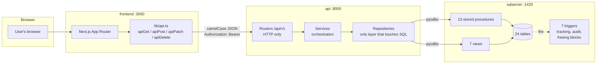
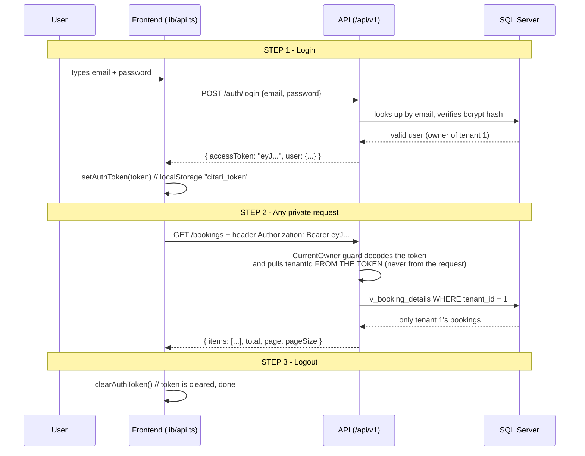
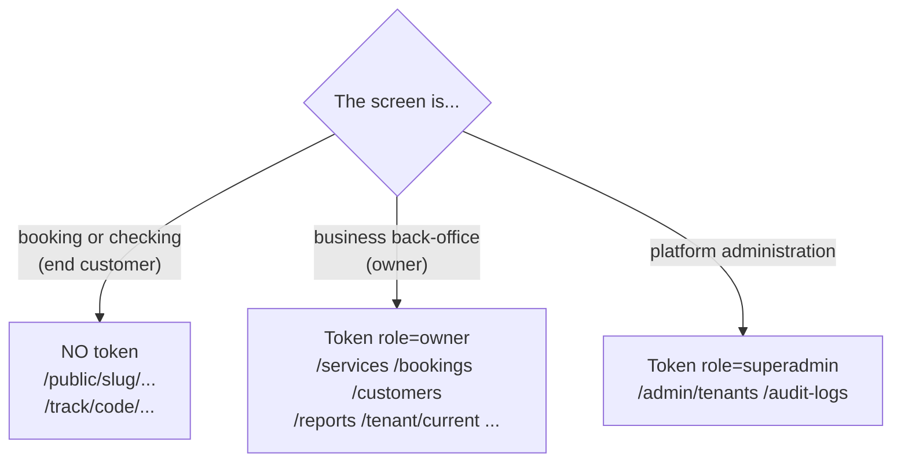

# Visual architecture: how everything connects

> Quick guide for any developer on the team. Diagrams render automatically on
> GitHub. Detailed API reference in [api-handover.md](api-handover.md).

## 1. The whole map at a glance

Three containers orchestrated by `docker compose up --build`:



Golden rules:

| Rule | What it means |
|---|---|
| The frontend's UI is Spanish | The user-facing text (labels, messages) — the product's market |
| The schema and API are both English | Tables/columns (`services`, `name`), JSON is camelCase (`serviceId`, `firstName`) |
| The API translates casing | Mappers convert snake_case -> camelCase, in exactly one place |
| Business logic lives in SQL | Writes go through stored procedures, reads go through views |
| Triggers do the magic automatically | Tracking codes, audit logging, and freeing blocks are AUTOMATIC: never reimplement them in the API or frontend |

## 2. What's on which port

| URL | What's there |
|---|---|
| http://localhost:3000 | Next.js frontend |
| http://localhost:8000/api/v1/... | API (every endpoint) |
| http://localhost:8000/docs | Interactive OpenAPI docs (try endpoints without the frontend) |
| localhost:11433 | SQL Server (DBeaver/Azure Data Studio, credentials in `.env`) |

## 3. JWT in 3 steps (how login works)



Three claims travel inside the token: `sub` (user id), `role` (`owner` or
`superadmin`), and `tenantId` (owners only). Expires in 60 minutes; on expiry
the API returns 401 and the frontend should redirect to login.

## 4. How to use it from frontend code

Already fully implemented in `apps/frontend/lib/api.ts`. Usage:

```ts
// LOGIN (once): stores the token
import { apiPost, setAuthToken } from "@/lib/api";
import { endpoints } from "@/lib/endpoints";

const res = await apiPost<LoginResponse>(endpoints.auth.login, {
  email, password, role: "owner",
});
setAuthToken(res.accessToken);   // ends up in localStorage "citari_token"
```

```ts
// ANY PRIVATE CALL after login:
// the Authorization: Bearer header is added ONLY if a token is stored
import { apiGet, apiPost } from "@/lib/api";

const page = await apiGet<Page<Booking>>("/bookings?page=1&pageSize=20");
const created = await apiPost<Service>("/services", {
  categoryId: 1, name: "Premium haircut", durationMinutes: 45,
});
```

```ts
// ERRORS: the API responds RFC 7807 and api.ts converts it to ApiError
try {
  await apiPost("/public/copper-blade-barbershop/bookings", body);
} catch (e) {
  if (e instanceof ApiError && e.status === 409) {
    // someone else already booked that block
    showMessage(e.detail);
  }
}
```

```ts
// LOGOUT
import { clearAuthToken } from "@/lib/api";
clearAuthToken();
router.push("/login");
```

## 5. Public vs. private: who needs a token



- The public booking flow never asks for login: the customer gets a
  **tracking code** (`CITARI-XXXXXX`, generated by a trigger) and uses it to
  check/cancel/reschedule.
- An owner only ever sees THEIR tenant: `tenantId` comes from the token, so
  it's impossible to request another business's data (the API returns 404).

## 6. Recipe: wiring up a new screen in 5 steps

1. Find the endpoint in [api-handover.md](api-handover.md) or at http://localhost:8000/docs.
2. If the TS type doesn't exist yet, add it in `apps/frontend/types/` (camelCase, matching the JSON).
3. Call it with the `lib/api.ts` helpers (`apiGet`/`apiPost`/...) using the constant from `lib/endpoints.ts`.
4. If the screen is private, no special handling needed: the Bearer header is added automatically when a token exists; handle 401 by redirecting to login.
5. Listings are paginated: read `res.items` and `res.total` (don't assume a flat array).

## 7. Bringing everything up from scratch (2 commands)

```bash
cp .env.example .env          # and generate JWT_SECRET: openssl rand -hex 32
bash scripts/setup-db.sh      # SQL Server + 24 tables + seed + SPs + views + triggers
docker compose up --build     # API :8000 + frontend :3000
```

Test credentials in `database/docs/PASSWORDS.md`. Demo tenant: `copper-blade-barbershop`.
