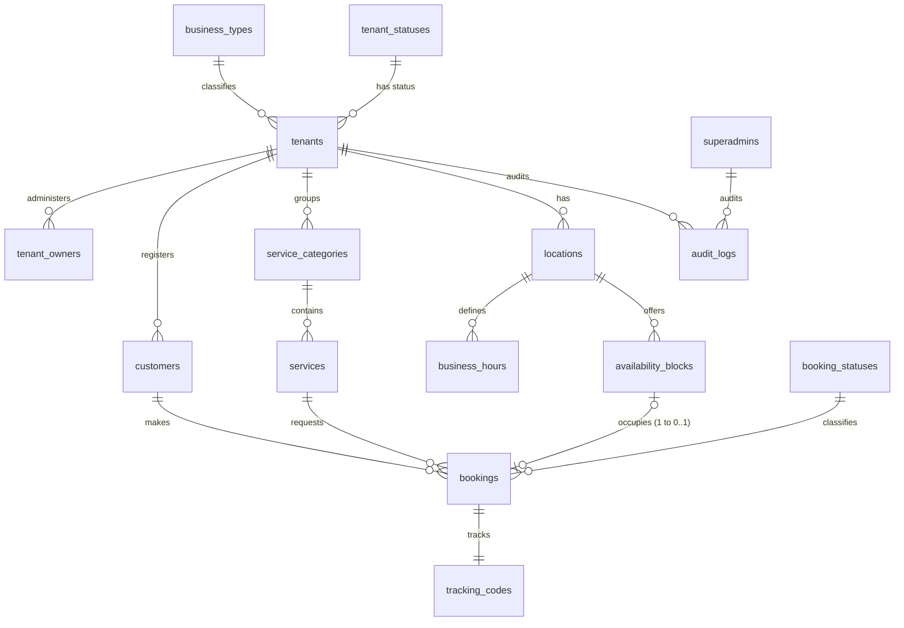
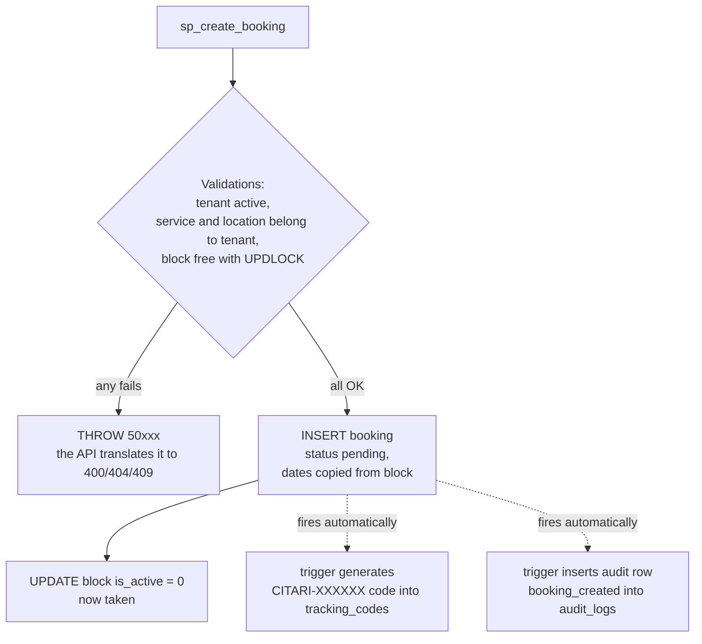
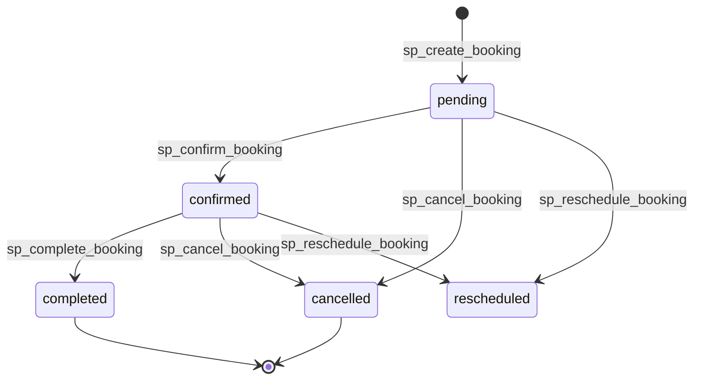
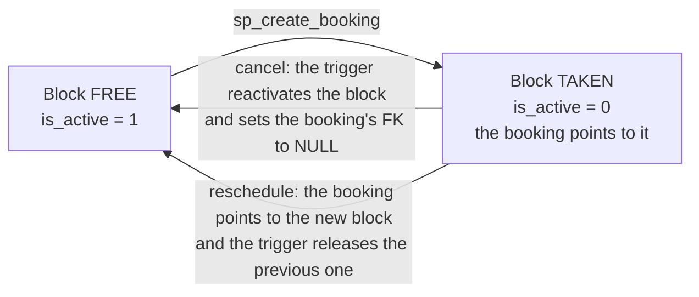

# Database: design and built state

> This document describes the database AS BUILT in
> `database/scripts/` (verifiable against the instance with `scripts/check-all.sql`).
> Exact SP/view/function signatures live in
> [sql-signatures.md](sql-signatures.md).

Relevant design points:

- SQL object names in English ASCII (sp_create_booking,
  v_booking_details...) aligned to the MR model in the drawio.
- Side effects (tracking, audit, releasing a block): anti-double-effect
  rule, live ONLY in triggers; SPs validate and orchestrate.
- One block per booking: filtered UNIQUE index ux_bookings_availability_block
  (allows multiple cancelled bookings to keep a NULL FK).
- Releasing a block on cancel: the trigger reactivates the block and sets
  the FK to NULL; history stays in the denormalized dates.
- Concurrency: sp_create_booking and sp_reschedule_booking take
  UPDLOCK/HOLDLOCK inside a transaction.
- Business errors via THROW by range: 50001-50019 validation,
  50020-50039 not found, 50040-50059 conflict.
- Booking/block dates: start_time/end_time DATETIME2 (merged date and
  time), block_date DATE stays on availability_blocks.
- Person names: first_name + last_name_1 + last_name_2 (last_name_2 optional).
- Seed: 50 coherent rows per table generated by scripts/gen-seed.py
  (deterministic); cancelled bookings in the seed free their block.
- Seed and trigger audit: tenant_created (seed), booking_created and
  booking_updated (triggers).

## Tables built

| Table | Purpose |
| --- | --- |
| business_types | Allowed business types. |
| tenant_statuses | Possible statuses of a tenant. |
| superadmins | Global administrators of the Citari platform. |
| tenants | Businesses registered on Citari. |
| tenant_owners | Owners/administrators of each tenant. |
| customers | Customers who make bookings. |
| service_categories | Service categories per business. |
| services | Services offered by each tenant. |
| locations | Business location/branch. |
| business_hours | General business hours. |
| availability_blocks | Bookable availability blocks. |
| booking_statuses | Possible statuses of a booking. |
| bookings | Bookings made. |
| tracking_codes | Public codes for looking up bookings. |
| audit_logs | Log of important actions (audit trail). |

Per-table columns are defined in `database/scripts/02-create-tables.sql`.
Relevant details:

- bookings.availability_block_id is NULL-able with ON DELETE SET NULL and
  its uniqueness is enforced with the filtered index
  `ux_bookings_availability_block (WHERE availability_block_id IS NOT NULL)`:
  a block can only be held by one booking at a time, but multiple
  cancelled/rescheduled bookings can coexist with a NULL FK.
- start_time and end_time are DATETIME2 both on availability_blocks and on
  bookings (intentional denormalization for history).
- Physical identifiers are pure ASCII English (tenant_owners,
  password_hash); this is a change from the earlier Spanish-ASCII schema
  (the eñe used to live only in the MR model of the drawio; it no longer
  appears anywhere).
- The database is called citari, collation Latin1_General_CI_AI (DATA can
  still carry accents and eñes).

## Relationship diagram (quick view)

Compact version for orientation; the full model is in the drawio
(`infra/citari-erd.drawio`, MR tab) and the detailed diagram is in
the README. GitHub and the VS Code preview render this diagram.



How to read it: everything hangs off `tenants` (the business/tenant). The
main flow chain is: a location offers blocks, a customer books a block for
a service, and each booking receives an automatic tracking code.

## The life of a booking (with real seed data)

To see how the tables connect, we follow booking 1 from the seed through
the database. These rows exist exactly like this after running the scripts
(verifiable with `SELECT * FROM v_booking_details WHERE booking_id = 1`).

Step 1, the business context (tenant 1):

| table | real row |
| --- | --- |
| tenants | id 1: Copper & Blade Barbershop, slug copper-blade-barbershop, status active |
| locations | id 1: Downtown Branch (of tenant 1) |
| services | id 1: Classic Haircut, 30 minutes |
| customers | id 1: John Carver, regular customer, notes "Regular - prefers Saturdays" |

Step 2, the bookable block and the booking:

| table | real row |
| --- | --- |
| availability_blocks | id 1: 2026-09-03 from 09:00 to 09:30, is_active 0 (taken) |
| bookings | id 1: customer 1 + service 1 + location 1 + block 1, status confirmed, 2026-09-03 09:00 to 09:30 |
| tracking_codes | CITARI-FMT01, expires 2026-10-03 |
| audit_logs | action booking_created on booking 1 |

Notice the booking's duration (09:00 to 09:30 = 30 min) matches
duration_minutes on the service, and the dates are COPIED onto the booking
(intentional denormalization to preserve history).

What happens when a booking is created through the API or the SP:



The dashed arrows are the triggers: nothing calls them, they fire on their
own. That's why neither the SP nor the API inserts tracking or audit rows
(anti-double-effect rule).

## Lifecycle of a booking and its block

Real statuses from `booking_statuses` and who records each transition:



Each transition fires the audit trigger (booking_updated, with the previous
and new status). Cancellation also releases the block:



Real example from the seed: booking 4 (Copper & Blade Barbershop, status
cancelled, code CITARI-WWW04) has availability_block_id NULL, but keeps its
dates 2026-09-04 11:00 to 11:30 in the denormalized columns; its original
block was reactivated (is_active = 1) and can be booked again. That's how
the filtered unique index lets many cancelled bookings coexist without
colliding.

## Test data built (real seed)

Generated by `scripts/gen-seed.py` (deterministic, `--check` compares
byte-for-byte). 50 rows per table, semantically coherent: each booking uses
a customer/service/location/block from the same tenant and its dates match
the block.

Real examples from the seed (useful for testing):

- Slugs: copper-blade-barbershop, serene-springs-spa, willowbrook-veterinary.
  Public URL: /book/copper-blade-barbershop
- Tenants: Copper & Blade Barbershop, Serene Springs Spa, Willowbrook
  Veterinary Clinic (+ demo filler up to 50 rows).
- Services: Classic Haircut, Buzz Cut, Beard Trim, and others per tenant.
- Tenant statuses: pending, active, suspended, inactive.
- Booking statuses: pending, confirmed, cancelled, completed, rescheduled.
- Cancelled bookings in the seed have availability_block_id = NULL and
  their block is_active = 1 (bookable again), replicating the effect of the
  release trigger.
- Test credentials: see `database/docs/PASSWORDS.md`.

First real rows, useful to see the pattern:

| booking | tenant | block | status | dates (copied from block) | code |
| --- | --- | --- | --- | --- | --- |
| 1 | Copper & Blade Barbershop | 1 (taken) | confirmed | 2026-09-03 09:00 to 09:30 | CITARI-FMT01 |
| 2 | Copper & Blade Barbershop | 2 (taken) | completed | 2026-09-03 10:00 to 10:20 | CITARI-LYL02 |
| 3 | Copper & Blade Barbershop | 3 (taken) | pending | 2026-09-04 09:00 to 09:15 | CITARI-RKD03 |
| 4 | Copper & Blade Barbershop | NULL (released) | cancelled | 2026-09-04 11:00 to 11:30 | CITARI-WWW04 |

Row 4 is the interesting case: cancelled, no block (FK NULL) but with its
historical dates intact — exactly what the release trigger produces at
runtime.

## SQL scripts built

```text
database/scripts/
├── 01-create-database.sql   creates citari from scratch
├── 02-create-tables.sql     24 tables, PK/FK/UQ + filtered index
├── 03-seed-data.sql         seed generated by scripts/gen-seed.py
├── 04-procedures.sql        13 stored procedures
├── 05-functions.sql         6 scalar functions
├── 06-views.sql             7 multi-table views
├── 07-triggers.sql          7 triggers
└── 08-full-script.sql       everything together, one pass on a clean server
```

Execution: `bash scripts/setup-db.sh` (runs 01-07 in order inside the
container) or the full 08 in one shot. Verification: `scripts/check-all.sql`
prints per-table counts and a basic schema sanity check;
`scripts/smoke-db.sql` runs 12 re-runnable smoke cases (booking, rejected
double booking, cancellation with release, etc.).

Note for manual execution: the scripts assume QUOTED_IDENTIFIER ON
(required by the filtered index). SSMS and Azure Data Studio default to ON;
sqlcmd needs the -I flag (the setup scripts already include it).

## Stored procedures built (13)

In `database/scripts/04-procedures.sql`. Full signatures with parameters and
THROW codes in [sql-signatures.md](sql-signatures.md).

| Procedure | Purpose |
| --- | --- |
| sp_create_tenant | Create a new tenant with initial status pending. |
| sp_activate_tenant | Activate a tenant from superadmin. |
| sp_suspend_tenant | Suspend a tenant. |
| sp_create_owner | Create a business owner associated with a tenant. |
| sp_create_service | Create a service (validates the category belongs to the tenant). |
| sp_update_service | Update a service. |
| sp_create_availability_block | Create a block (validates no overlap at the location). |
| sp_create_customer | Create or reuse a customer by (tenant, email). |
| sp_create_booking | Create a public or internal booking with pessimistic locking. |
| sp_confirm_booking | Confirm a booking (validates the status transition). |
| sp_cancel_booking | Cancel a booking. |
| sp_reschedule_booking | Reschedule a booking to another block. |
| sp_complete_booking | Mark a booking as completed. |

Business errors via THROW by range (the API translates them to HTTP):

| Range | Meaning | HTTP |
| --- | --- | --- |
| 50001-50019 | Business validation | 400 |
| 50020-50039 | Not found / doesn't belong to the tenant | 404 |
| 50040-50059 | Conflict (block taken, overlap) | 409 |

sp_create_booking (the critical one) handles:

- Validating the tenant is active and that service/location belong to it.
- Taking the block with SELECT ... WITH (UPDLOCK, HOLDLOCK) inside a
  transaction (SET XACT_ABORT ON) and validating it's free.
- Creating or reusing the customer.
- Inserting the booking with dates copied from the block, status pending.
- Occupying the block (is_active = 0).
- NOT generating tracking or audit rows: triggers do that (anti-double-
  effect rule).

sp_cancel_booking changes the status to cancelled, validating the
transition; releasing the block (is_active = 1 and FK to NULL) and the
audit row are done by triggers. sp_reschedule_booking takes the new block
with the same locking, occupies it and copies dates; the trigger releases
the previous one.

## SQL functions built (6)

In `database/scripts/05-functions.sql`.

| Function | Purpose |
| --- | --- |
| fn_generate_tracking_code | Unique CITARI-XXXXXX code from a UNIQUEIDENTIFIER seed (the trigger passes NEWID(); alphabet without ambiguous characters 0/O/1/I). |
| fn_is_tenant_active | 1 if the tenant exists, is_active = 1 and status 'active'. |
| fn_is_block_available | 1 if the block exists, is_active = 1 and has no active booking. |
| fn_total_bookings_by_tenant | Total bookings for a tenant. |
| fn_total_bookings_by_service | Total bookings per service. |
| fn_booking_duration | Duration in minutes (DATEDIFF over the booking's dates). |

## SQL views built (7)

In `database/scripts/06-views.sql`. All join 2 or more tables (verifiable
with sys.sql_expression_dependencies).

| View | Tables | Purpose |
| --- | --- | --- |
| v_booking_details | 7 | Bookings with tenant, customer, service, location, status and tracking. |
| v_tenant_dashboard | 6 | Summary of bookings, customers, services and locations per tenant. |
| v_daily_agenda | 5 | Daily agenda of bookings per tenant. |
| v_availability_status | 5 | Available and booked blocks per location and date. |
| v_customer_booking_history | 4 | Booking history per customer. |
| v_service_demand | 3 | Total bookings and last booking per service. |
| v_public_services | 3 | Active services visible on the public page. |

## Triggers built (7)

In `database/scripts/07-triggers.sql`.

| Trigger | Purpose |
| --- | --- |
| tr_bookings_generate_tracking | AFTER INSERT: generates the tracking code (expires in 30 days). Supports multi-row insert. |
| tr_bookings_audit_insert | AFTER INSERT: audit row booking_created. |
| tr_bookings_audit_update | AFTER UPDATE: audit row booking_updated when the status changes (with previous and new value). |
| tr_tenants_updated_at | AFTER UPDATE: refreshes updated_at (with anti-recursion guard). |
| tr_services_updated_at | AFTER UPDATE: refreshes updated_at. |
| tr_prevent_double_booking | Defense in depth: ROLLBACK + THROW 50043 if two active bookings point to the same block (the filtered index and the SP's locking already prevent it; covers direct INSERTs). |
| tr_release_block_on_cancel | On transition to cancelled: reactivates the block and sets the FK to NULL (history stays in the denormalized dates). On reschedule: reactivates the previous block. |

Design rule (anti-double-effect): tracking, audit and block release live
ONLY in triggers. Stored procedures validate, lock and orchestrate, but
never duplicate these effects. Verifiable: there is no INSERT into
tracking_codes or audit_logs anywhere in 04-procedures.sql.

## Audit trail built

Actions the implementation generates in the audit_logs table:

- tenant_created, initial seed (one per business).
- booking_created, trigger on booking insert.
- booking_updated, trigger on every status change (confirmed, cancelled,
  completed, rescheduled) with old_value and new_value.

## Quick verification

WATCH OUT for database context: the catalog views (sys.tables, sys.views...)
are PER database. If your editor (DBeaver/SSMS/ADS) is pointed at `master`,
the sa connection's default, all the counts come back 0 even though the
script ran fine. That's why these queries are qualified with `citari.`:
they work no matter the current context. Alternative: switch the active
database in your editor's dropdown (or `USE citari;`) and query unqualified.

```sql
-- 0. Does the database exist?
SELECT name FROM sys.databases WHERE name = 'citari';

-- expected counts (or run scripts/check-all.sql in full,
-- with the editor pointed at citari)
SELECT COUNT(*) AS tables    FROM citari.sys.tables;                              -- 24
SELECT COUNT(*) AS sps       FROM citari.sys.procedures;                          -- 13
SELECT COUNT(*) AS views     FROM citari.sys.views;                               -- 7
SELECT COUNT(*) AS triggers  FROM citari.sys.triggers;                            -- 7
SELECT COUNT(*) AS functions FROM citari.sys.objects WHERE type IN ('FN','IF','TF'); -- 6
SELECT COUNT(*) AS bookings  FROM citari.dbo.bookings;                            -- 50
```
