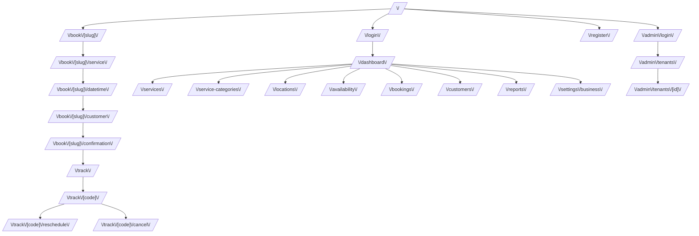

# Frontend map

Route map for the Citari frontend and its relationship to the API.

`/business-hours` used to exist as a separate screen and now **redirects** to
`/availability`: configuring the weekly schedule and publishing bookable
slots was merged into a single flow (see below).

## Frontend -> backend endpoint mapping

- **Public**:
  - `/book/[slug]` uses `GET /public/{slug}`
  - `/book/[slug]/service` uses `GET /public/{slug}/services`
  - `/book/[slug]/datetime` uses `GET /public/{slug}/availability` (includes `locationId` per block)
  - `/book/[slug]/customer` creates the booking with `POST /public/{slug}/bookings` and navigates to confirmation with the real `trackingCode`
  - `/track`, `/track/[code]` use `GET /track/{code}`
  - `/track/[code]/cancel` uses `POST /track/{code}/cancel`
  - `/track/[code]/reschedule` uses `POST /track/{code}/reschedule`

- **Business owner** (all wired to the real API, with fallback to mock data if `NEXT_PUBLIC_API_MODE=mock`):
  - `/dashboard` uses `GET /reports/dashboard` + `GET /bookings`
  - `/services` uses `GET/POST/PATCH/DELETE /services` (+ `GET /service-categories` for the selector)
  - `/service-categories` uses `GET/POST/PATCH/DELETE /service-categories`
  - `/locations` uses `GET/POST/PATCH/DELETE /locations`
  - `/availability` unifies two things into a single screen:
    - weekly schedule per location (`GET/PUT /business-hours?locationId=`)
    - generation of bookable slots (`GET /availability-blocks`, `POST /availability-blocks` in bulk, `DELETE /availability-blocks/{id}`), respecting the configured schedule and never generating slots in the past
  - `/bookings` uses `GET /bookings` + `POST /bookings/{id}/{confirm,cancel,complete,reschedule}`
  - `/customers` uses `GET/POST /customers`
  - `/reports` uses `GET /reports/{dashboard,services-demand,availability-status}`
  - `/settings/business` uses `GET/PATCH /tenant/current`

- **Superadmin**:
  - `/admin/login` logs in with `role: "superadmin"` (unlike the owner `/login`, which always sends `role: "owner"`)
  - `/admin/tenants` uses `GET /admin/tenants` + `POST /admin/tenants/{id}/{activate,suspend}`
  - `/admin/tenants/[id]` uses `GET /admin/tenants/{id}`

## Wiring status

The whole frontend consumes the real API by default (`NEXT_PUBLIC_API_MODE=api`,
already the value in the development `docker-compose.yml`). Mock mode
(`NEXT_PUBLIC_API_MODE=mock`) remains available as a design demo with no
backend, using `lib/mock-data.ts`.

**Only known limitation**: the public booking flow works fully end to end
(it creates a real booking and returns a real tracking code). There is
nothing left to wire up in the back office or the superadmin panel.
